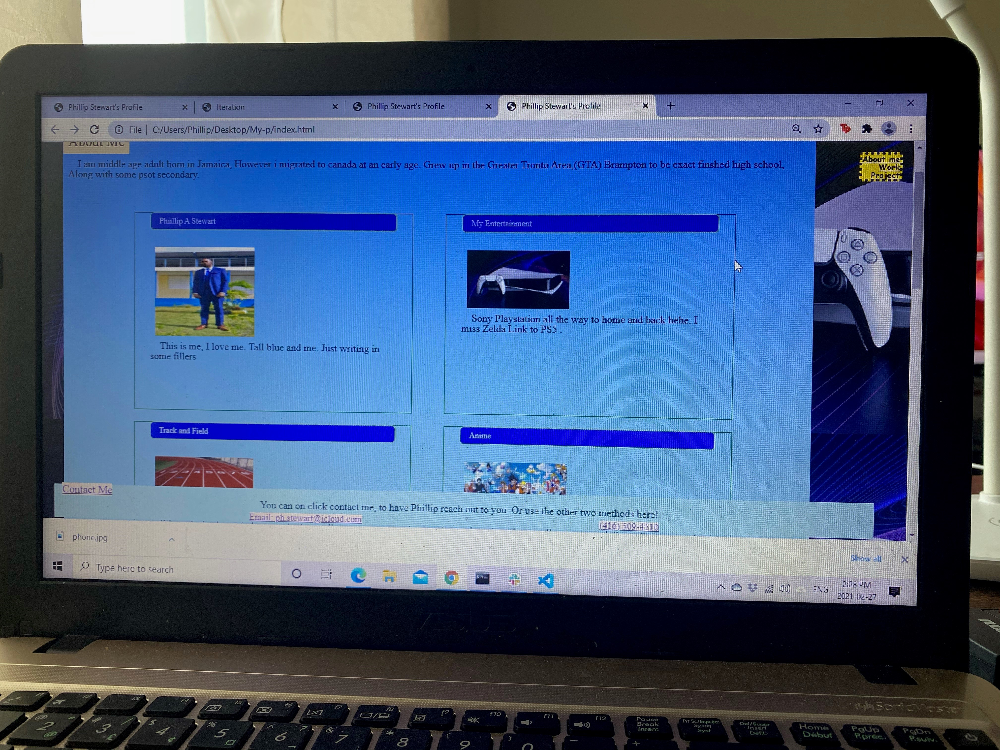
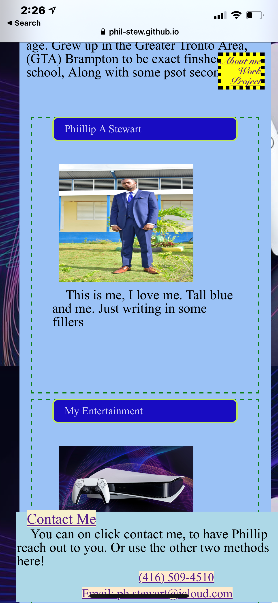

# My-PFolio
This in infomation about me things  i liked, where i grew up.
searhed for some images on google to used 
I used some code from our lesson to make columns and  added some images and text to it 
I created some place older content
i checked webpages using my iphone hover doesnt work on the iphone
created a contact me pages with working links at  the bottom.
clicking on my number opens images with phone
click email opens icloud.com
clicking contact me opens form sheet to be submit
sumbit buttun looks small on mobile screen
can be fix later...
nav links at the top are fix on the the pages along with the contact partsof the page
 other links dont lead to anywhere as of now.
 My task was to creat a portfilio similar to the on blow
 sub heading and images increase in size when hoverd
 all picture links takes you to github.com when clicked
because i dont have any projects yet to added
 small links in blue doesnt go anywhere

this is what is look like deploy on my computer

this is what it looks like deployed on iphone

added links to home that wwill take you to GITHUB
added resume and profile pic on github

## Version Update 

head the server files and add the use of bootstrip 
reworked some using boot strip and added more links to my work at the boot camp

